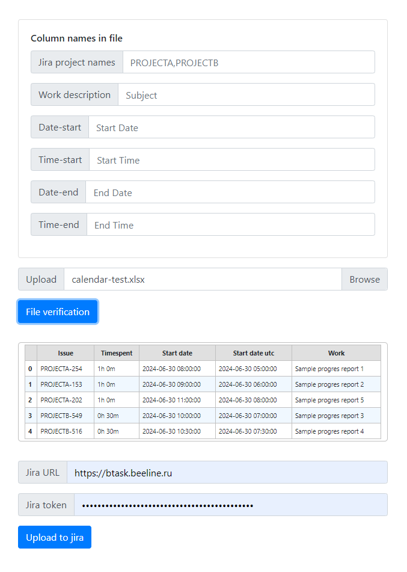
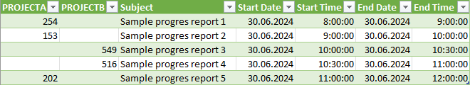

# TerryJira
The service for uploading worklogs from a excel's file to Jira
## How to use
- Specify column names according to their purpose
- Select the Excel file with worklogs
- Upload the file to prepare for sending
- Check the correctness of the worklogs
- Enter Jira URL and Jira API access token
- Send worklogs to Jira


## Requirements
### For users
-  Personal access token to Jira API
-  Excel file with one or more sheets with the following columns:
   -  Jira project key (One or more coulmns with project key)
   -  Work description
   -  Start date
   -  Start time
   -  End date
   -  End time
 
   
   [Example excel file](docs/calendar-test.xlsx)

  Other columns will be ingored
### For service
- Docker
- Network connectivity to Jira  
## Install proccess
- Prepare settings and default values in `config.yaml` file:
  - Listener server ip `address`
  - Listener tcp `port`
  - Default names for required columns for excel file
  - Default Jira URL

  Example file config.example.yaml`:
  ```yaml 
   address: 0.0.0.0
   port: 8081
   columns:
      jiraprojects:
         - PROJECTA
         - PROJECTB
      work: Subject
      startdate: Start Date
      starttime: Start Time
      enddate: End Date
      endtime: End Time
   jiraurl: https://jira.example.org
  ```

- First run `run.sh` for Linux or `run.ps1` for MS Windows
- Go to the <http://server:port>
