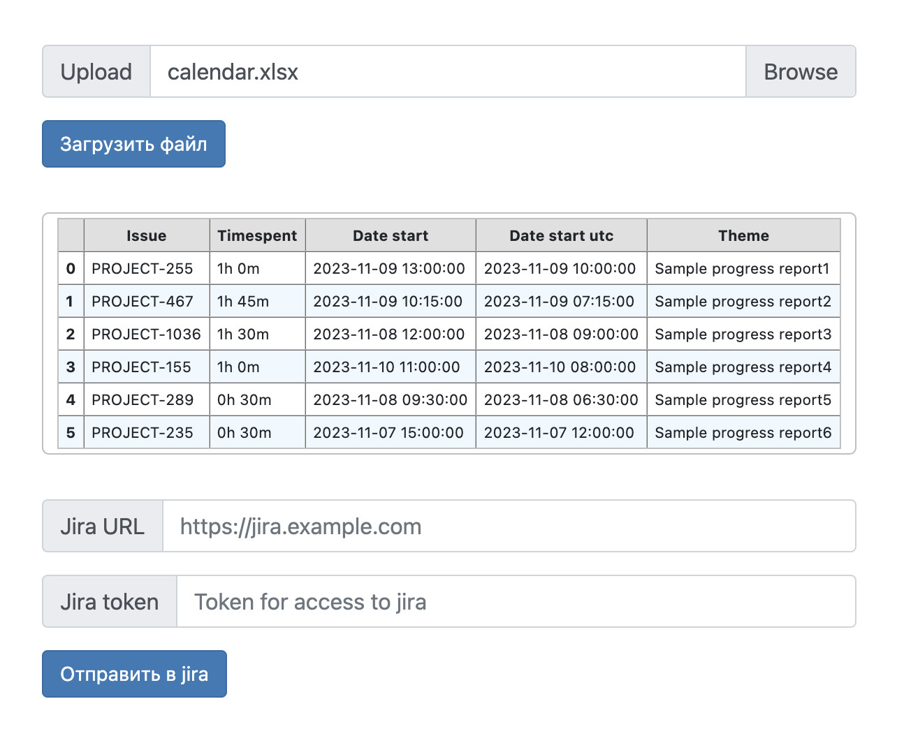

# TerryJira
The service for uploading worklogs from a excel's file to Jira
## How to use
- Select the Excel file with worklogs
- Upload the file to prepare for sending

- Check the correctness of the worklogs
- Enter Jira URL and Jira API access token

- Send worklogs to Jira
## How to install
### Requirements
#### For service
- Docker
- Network connectivity to Jira
#### For users
- Personal access token to Jira API
- Excel file with columns:
    - \<Jira project\>
    - Theme
    - Date start
    - Time start
    - Date end
    - Time end
    
    Other columns will be ingored
  
### Install proccess
- Prepare settings in `config.yaml` file:
  - Listener `address`
  - Listener `tcp port`
  - Default names of columns for excel file

  Example:
  ```yaml 
  address: 0.0.0.0
  port: 8081
  columns:
     jira-projects:
        - PROJECT1
        - PROJECT2
        - etc
     Theme: Тема
     Date-start: Дата начала
     Time-start: Время начала
     Date-end: Дата окончания
     Time-end: Время окончания
  ```

- First run `run.sh` for Linux or `run.ps1` for MS Windows
- Go to the <http://address:port>